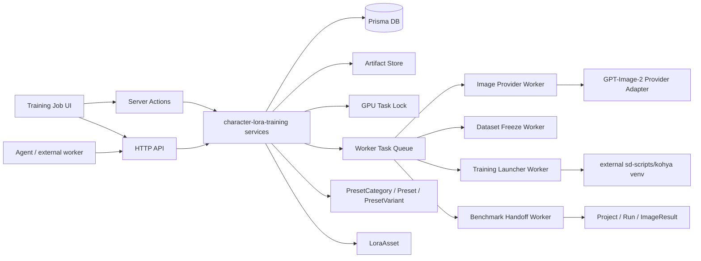
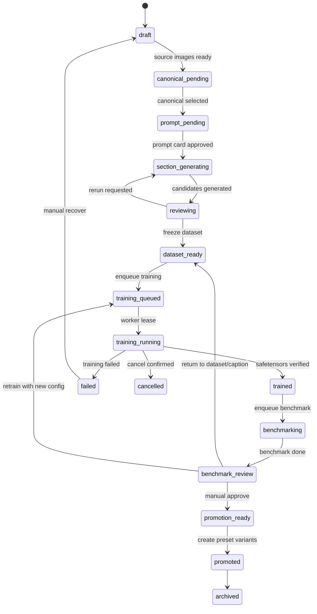
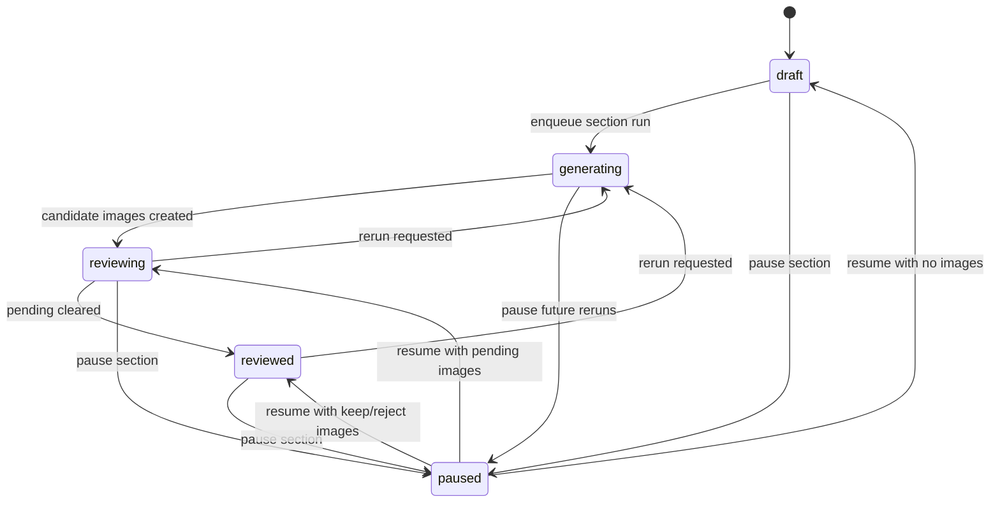
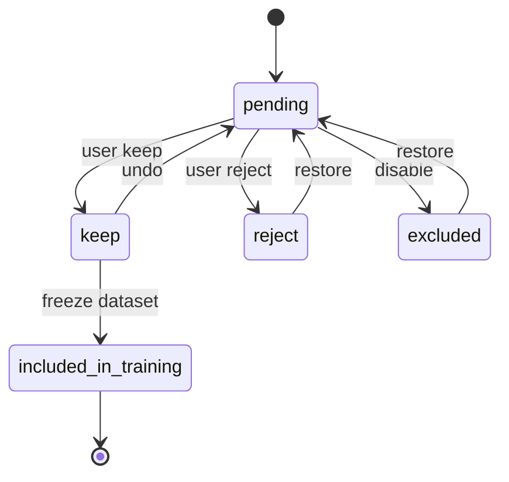
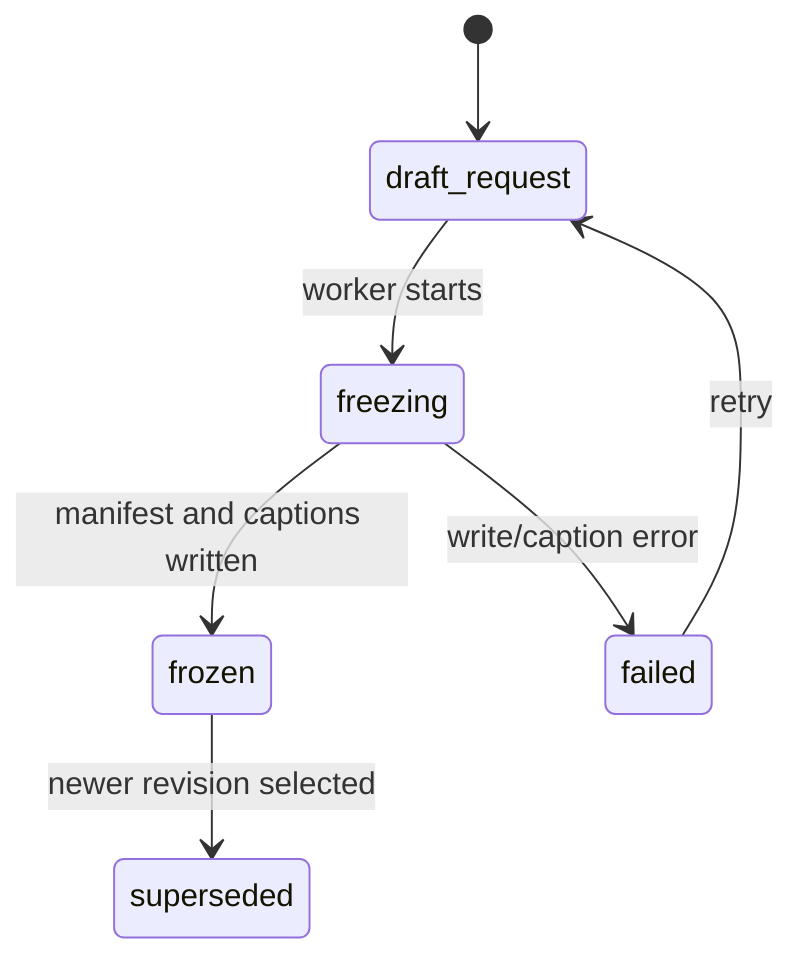
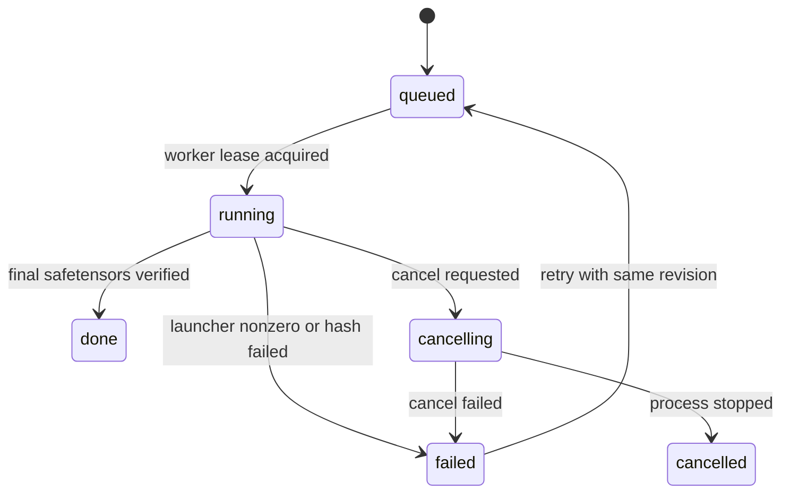
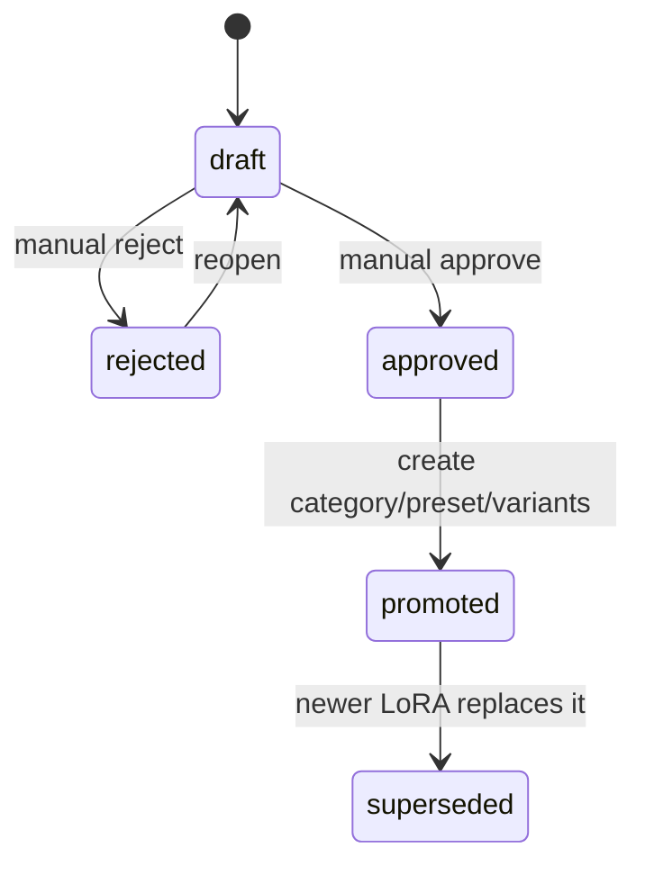
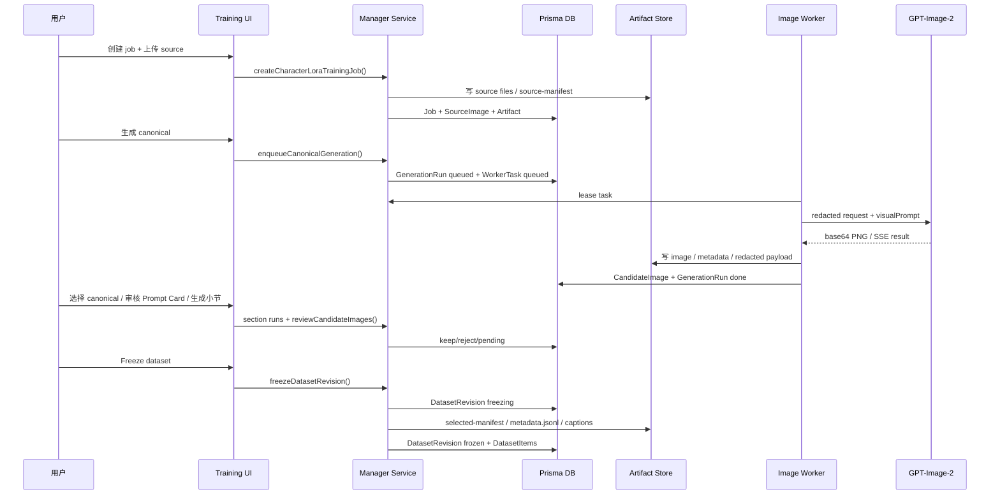
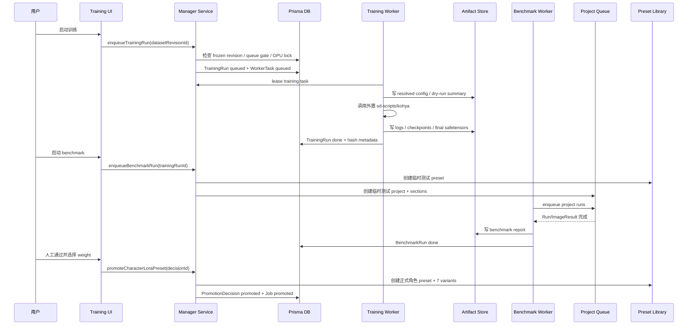
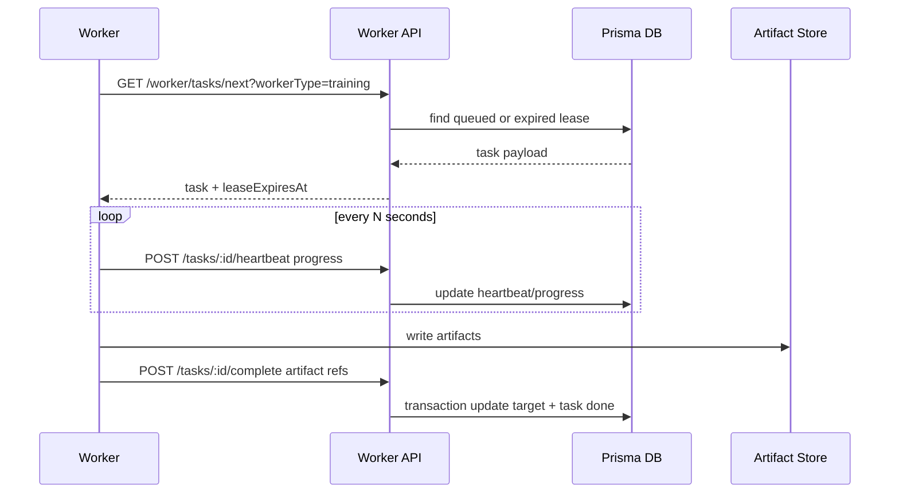

# 角色 LoRA 自训练 Manager 集成开发计划

Source PRD: `docs/prd/character-lora-training-manager-prd.md` v0.1, 2026-05-22.

本文目标是把 PRD 中的“参考图/设定图 -> 训练集生成与审图 -> LoRA 训练 -> LoRA 测试 -> 人工审核 -> 正式角色 preset”拆成可落地的数据模型、接口、worker 契约和分阶段实施计划。本文不包含任何 token、OAuth refresh token、账号 ID 或其他密钥值；后续实现也只能记录 auth source shape 和 redacted request payload。

## 1. 设计结论

第一版按这些边界执行：
- 一个 training job 只管理一个角色的一套主要服装/形态，不做角色维度聚合视图，不把最终 preset 的 7 个状态拆成 7 个训练 job。
- GPT-Image-2 封装为 image provider adapter；prompt layering、审图、重试、版本决策和失败诊断由 Manager/worker 显式控制。
- 训练环境外置，Manager 只负责配置、启动、状态、取消、产物索引和报告；sd-scripts/kohya/venv 不进入 Next runtime。
- promotion 必须先跑现有 `角色 lora 测试` 临时项目并人工通过；训练成功本身不能自动创建正式 preset。
- synthetic 图默认 `pending`，必须人工 `keep` 后才能进入 frozen dataset revision。
- DB 负责索引和可查询状态，artifact store 保存大文件、prompt、caption、配置、日志、报告和 redacted provider payload。
- 后续任何实现批次只要涉及超过 3 个文件，或预计新增/修改超过 100 行，并且不是简单机械替换，必须按 AGENTS 规则交给子代理执行；主代理只做编排、验收和返工。

## 2. 与现有系统的对齐

代码走查后需要保留这些现有约定：

| 现有模块 | 对齐方式 |
| --- | --- |
| `PresetCategory` / `Preset` / `PresetVariant` | promotion 最终创建或更新正式角色 preset；7 个标准变体保存在 `PresetVariant`，LoRA 绑定写入 `lora1` / `lora2` JSON。 |
| `ProjectTemplate` / `ProjectTemplateSection` | benchmark 阶段复用现有 `角色 lora 测试` 模板，不复制一套普通生图模板逻辑。 |
| `Project` / `ProjectSection` / `Run` / `ImageResult` | benchmark 仍走普通项目运行能力；训练集候选图不要混入普通项目结果，除非明确作为 benchmark 输出。 |
| `LoraAsset` | 训练产出的 `.safetensors` copy/register 到 `MODEL_BASE_DIR/loras/character` 后登记为 `modelType="lora"` 的资产。 |
| `src/lib/lora-types.ts` | 正式 preset 和项目 section 的 LoRA 配置仍使用 `{ path, weight, enabled }`，项目内扩展用 `LoraEntry` 的 `source` / `bindingId` 等字段。 |
| `src/lib/api-response.ts` | 新增 HTTP API 统一返回 `{ ok: true, data }` / `{ ok: false, error }`。 |
| App Router API | 动态 route 继续使用当前 Next 约定：`context.params` 是 `Promise<{ ... }>`。 |
| 双 Prisma schema | PostgreSQL schema 和 SQLite schema 必须同时更新；SQLite 中 enum 需要用 string 字段表达等价状态。 |
| `/api/worker/status` | 启动训练、清理 `.next`、重启服务前继续把 queued/running 作为部署和长任务 gate。 |

## 3. 总体架构



建议新增模块边界：

| 层 | 建议路径 | 责任 |
| --- | --- | --- |
| 页面 | `src/app/character-lora-training/**` | job 列表、详情、canonical、Prompt Card、小节审图、dataset、training、benchmark、promotion 工作台。 |
| Server actions | `src/lib/actions/character-lora-training.ts` | 浏览器表单/按钮触发的 mutation，继续从 `src/lib/actions.ts` re-export。 |
| HTTP API | `src/app/api/character-lora-training/**/route.ts` | agent、worker、自动化脚本和 UI fetch 的稳定接口。 |
| Service | `src/server/services/character-lora-training/**` | 业务规则、状态迁移、artifact 写入、provider/worker 调度、promotion。 |
| Repository | `src/server/repositories/character-lora-training-repository.ts` | Prisma 查询和事务封装。 |
| Worker contracts | `src/server/character-lora-training/contracts.ts` | worker task payload、provider input/output、状态文件格式。 |
| Artifact service | `src/server/services/character-lora-training/artifact-service.ts` | 路径归一、hash、redaction、manifest 读写、安全删除策略。 |

## 4. 数据模型与表设计

命名可以在实现时根据实际偏好压缩，但关系和状态必须保留。所有 `Json` 字段在 service 层配 zod/schema parser，避免直接把任意 JSON 透传到 UI 或 worker。

### 4.1 枚举

| 枚举 | 值 | 用途 |
| --- | --- | --- |
| `CharacterLoraJobStatus` | `draft`, `canonical_pending`, `prompt_pending`, `section_generating`, `reviewing`, `dataset_ready`, `training_queued`, `training_running`, `trained`, `benchmarking`, `benchmark_review`, `promotion_ready`, `promoted`, `failed`, `cancelled`, `archived` | job 主状态。 |
| `CharacterLoraImageReviewStatus` | `pending`, `keep`, `reject`, `excluded`, `included_in_training` | 候选训练图筛选状态；不要直接复用 `ReviewStatus.trashed` 语义。 |
| `CharacterLoraRunStatus` | `queued`, `running`, `done`, `failed`, `cancelled` | canonical/section generation、dataset freeze、training、benchmark worker run 通用状态。 |
| `CharacterLoraArtifactKind` | `source_image`, `canonical_image`, `candidate_image`, `prompt`, `provider_payload`, `caption`, `dataset_manifest`, `training_config`, `training_log`, `safetensors`, `benchmark_report`, `promotion_report` | artifact 分类。 |
| `CharacterLoraWorkerType` | `image_generation`, `dataset_freeze`, `training`, `benchmark`, `promotion` | worker task 类型。 |
| `CharacterLoraDecisionStatus` | `draft`, `approved`, `rejected`, `promoted`, `superseded` | benchmark/promotion 人工决策。 |

### 4.2 核心表

#### `CharacterLoraTrainingJob`

| 字段 | 类型 | 说明 |
| --- | --- | --- |
| `id` | `String @id @default(cuid())` | 主键。 |
| `slug` | `String @unique` | artifact 目录和 URL 友好标识。 |
| `characterName` | `String` | 用户看到的角色名。 |
| `triggerToken` | `String` | caption 第一位 token；建议 active job + promoted preset 范围唯一。 |
| `status` | enum/string | job 主状态。 |
| `phase` | `String?` | UI 阶段：`canonical`, `prompt_card`, `sections`, `dataset`, `training`, `benchmark`, `promotion`。 |
| `trainingScope` | `Json` | 主要服装/形态、禁止混训说明、是否高级实验。 |
| `captionStrategy` | `String @default("controllable_identity")` | caption 策略。 |
| `baseCheckpointName` | `String?` | 与现有项目 `checkpointName` 对齐。 |
| `baseCheckpointPath` | `String?` | checkpoint 相对或绝对路径；输出时做 redaction。 |
| `baseCheckpointHash` | `String?` | SHA256 或可用 hash。 |
| `baseFamily` | `String?` | SDXL、Illustrious、Pony 等。 |
| `artifactRoot` | `String` | job artifact root。 |
| `currentCanonicalVersionId` | `String?` | 当前选中的 canonical version。 |
| `currentPromptCardVersionId` | `String?` | 当前默认 Prompt Card version。 |
| `selectedDatasetRevisionId` | `String?` | 当前准备训练或已训练的 frozen dataset。 |
| `promotedPresetId` | `String?` | promotion 后的正式 `Preset.id`。 |
| `createdBy` | `String?` | 可先保留为文本。 |
| `failureSummary` | `String? @db.Text` | 最近失败摘要。 |
| `createdAt` / `updatedAt` | `DateTime` | 标准时间戳。 |

关系：`sourceImages[]`, `canonicalVersions[]`, `promptCardVersions[]`, `sections[]`, `generationRuns[]`, `datasetRevisions[]`, `trainingRuns[]`, `benchmarkRuns[]`, `promotionDecisions[]`, `artifacts[]`, `workerTasks[]`。

索引：`@@index([status, updatedAt])`, `@@index([triggerToken])`, `@@index([baseCheckpointHash])`。

#### `CharacterLoraSourceImage`

| 字段 | 类型 | 说明 |
| --- | --- | --- |
| `id` | `String` | 主键。 |
| `jobId` | `String` | 所属 job。 |
| `role` | `String` | `source`, `setting`, `local_reference`, `manual_canonical`, `rerun_reference`。 |
| `artifactId` | `String` | 指向 `CharacterLoraArtifact`。 |
| `filePath` | `String` | artifact 相对路径。 |
| `sha256` | `String` | 去重与 provenance。 |
| `width` / `height` | `Int?` | 图片尺寸。 |
| `provenance` | `Json?` | 上传来源、原始文件名、外部路径 redacted。 |
| `sortOrder` | `Int` | UI 顺序。 |
| `createdAt` | `DateTime` | 上传/登记时间。 |

约束：`@@unique([jobId, sha256, role])` 可以防止同一 job 重复 source；如果用户需要同图不同 role，role 会区分。

#### `CharacterLoraCanonicalVersion`

| 字段 | 类型 | 说明 |
| --- | --- | --- |
| `id` | `String` | 主键。 |
| `jobId` | `String` | 所属 job。 |
| `version` | `Int` | 从 1 开始，`@@unique([jobId, version])`。 |
| `status` | `String` | `candidate`, `selected`, `rejected`, `superseded`。 |
| `sourceRunId` | `String?` | 由哪个 generation run 产生；手动上传可为空。 |
| `imageArtifactId` | `String` | canonical 图片 artifact。 |
| `selectedAt` | `DateTime?` | 选中时间。 |
| `notes` | `String? @db.Text` | 人工备注。 |
| `createdAt` | `DateTime` | 创建时间。 |

规则：canonical 更新只新增 version，不覆盖旧 version；旧 section run、review、dataset revision 保留 lineage。`candidate` 可以被人工拒绝为 `rejected`；当前 `selected`/current canonical、`selected`、`superseded` 和已 `rejected` 版本不能被拒绝。`rejected` 版本保留在历史里，但不能再被选择为 current canonical。

#### `CharacterLoraPromptCardVersion`

| 字段 | 类型 | 说明 |
| --- | --- | --- |
| `id` | `String` | 主键。 |
| `jobId` | `String` | 所属 job。 |
| `canonicalVersionId` | `String?` | 该角色卡基于哪个 canonical。 |
| `version` | `Int` | 从 1 开始。 |
| `triggerToken` | `String` | 冗余保存当时 token。 |
| `identityTraits` | `Json` | 发色、发型、刘海、眼睛、瞳孔、耳朵、角、头饰等。 |
| `outfitTraits` | `Json` | 衣服结构、颜色、裙摆、袖子、袜子、鞋子、饰品等。 |
| `negativeTraits` | `Json?` | 负面约束。 |
| `finalPromptDraft` | `String @db.Text` | 默认 prompt 草案。 |
| `changeReason` | `String? @db.Text` | 手动编辑、从局部修正提升等。 |
| `createdAt` | `DateTime` | 创建时间。 |

约束：`@@unique([jobId, version])`。Prompt Card 被 section run 引用后不可原地变更；编辑会创建新 version。`canonicalVersionId` 不能指向 `rejected` canonical version；创建 Prompt Card 和从 section instruction 提升新 Prompt Card 时，如果显式或默认解析到 rejected canonical，返回 `409`，避免 rejected anchor 回到后续 lineage。

#### `CharacterLoraSectionTemplate`

| 字段 | 类型 | 说明 |
| --- | --- | --- |
| `id` | `String` | 主键。 |
| `key` | `String @unique` | `front_fullbody`, `turn_left_45`, `portrait` 等。 |
| `name` | `String` | UI 名称。 |
| `description` | `String?` | 小节目标。 |
| `angleTag` | `String?` | 角度/构图标签。 |
| `promptTemplate` | `String @db.Text` | section prompt template。 |
| `negativeTemplate` | `String? @db.Text` | section negative template。 |
| `targetCandidateCount` | `Int` | 默认候选数。 |
| `targetKeepCount` | `Int` | 最少 keep 数。 |
| `sortOrder` | `Int` | 默认排序。 |
| `isActive` | `Boolean` | 是否可选。 |

第一版可用 seed 脚本初始化默认 12 个模板：正面全身、左前 45°、右前 45°、左侧、右侧、背面、半身、头部特写、鞋袜/下半身细节、简单坐姿、简单动作、表情变化。

#### `CharacterLoraJobSection`

| 字段 | 类型 | 说明 |
| --- | --- | --- |
| `id` | `String` | 主键。 |
| `jobId` | `String` | 所属 job。 |
| `templateId` | `String?` | 来源模板；允许手工小节为空。 |
| `key` | `String` | job 内稳定 key。 |
| `name` | `String` | 小节名。 |
| `canonicalVersionId` | `String` | 默认引用的 canonical version。 |
| `promptCardVersionId` | `String` | 默认引用的 Prompt Card version。 |
| `targetCandidateCount` / `targetKeepCount` | `Int` | 小节目标。 |
| `status` | `String` | `draft`, `generating`, `reviewing`, `reviewed`, `paused`。`paused` 保留历史 runs/images/counts，必须显式 resume 才能继续生成或重跑。 |
| `keepCount` / `rejectCount` / `pendingCount` | `Int` | 可缓存，最终以 query 聚合校验。 |
| `sortOrder` | `Int` | UI 顺序。 |
| `createdAt` / `updatedAt` | `DateTime` | 标准时间戳。 |

约束：`@@unique([jobId, key])`, `@@index([jobId, sortOrder])`。

#### `CharacterLoraGenerationRun`

| 字段 | 类型 | 说明 |
| --- | --- | --- |
| `id` | `String` | 主键。 |
| `jobId` | `String` | 所属 job。 |
| `sectionId` | `String?` | canonical run 可为空。 |
| `kind` | `String` | `canonical`, `section`, `section_rerun`。 |
| `parentRunId` | `String?` | rerun lineage。 |
| `status` | enum/string | `queued`, `running`, `done`, `failed`, `cancelled`。 |
| `provider` | `String` | 第一版 `openai-codex`。 |
| `hostModel` | `String?` | 例如 host model 名称。 |
| `imageModel` | `String` | `gpt-image-2`。 |
| `hostInstruction` | `String @db.Text` | 只描述 host 如何调用工具，不承载画面语义。 |
| `visualPrompt` | `String @db.Text` | 真正视觉 prompt。 |
| `negativePrompt` | `String? @db.Text` | 如 provider 支持则记录。 |
| `toolParams` | `Json` | size、quality、format、background、partial images 等。 |
| `inputImages` | `Json` | `{ sourceImageId/artifactId/path/hash/role }[]`。 |
| `requestArtifactId` | `String?` | redacted request payload。 |
| `responseSummary` | `Json?` | 不含 secrets 的响应摘要。 |
| `errorSummary` | `String? @db.Text` | HTTP status / backend error 摘要。 |
| `startedAt` / `finishedAt` | `DateTime?` | 运行时间。 |
| `createdAt` / `updatedAt` | `DateTime` | 标准时间戳。 |

规则：自然语言修正默认只写入当前 run 的 `visualPrompt` / `userInstruction`，只有用户选择“提升为全局修正”才创建新 Prompt Card version。

#### `CharacterLoraCandidateImage`

| 字段 | 类型 | 说明 |
| --- | --- | --- |
| `id` | `String` | 主键。 |
| `jobId` | `String` | 所属 job。 |
| `sectionId` | `String?` | canonical candidate 可为空或指向 canonical pseudo section。 |
| `generationRunId` | `String` | 来源 run。 |
| `artifactId` | `String` | 图片 artifact。 |
| `filePath` | `String` | artifact 相对路径。 |
| `sha256` | `String` | 图片 hash。 |
| `width` / `height` / `fileSize` | `Int?` / `BigInt?` | 文件信息。 |
| `reviewStatus` | enum/string | `pending`, `keep`, `reject`, `excluded`, `included_in_training`。 |
| `rejectReasons` | `Json?` | 多选 reject reason。 |
| `reviewNote` | `String? @db.Text` | 人工说明。 |
| `captionDraft` | `String? @db.Text` | freeze 前可编辑 caption。 |
| `reviewedAt` | `DateTime?` | 审图时间。 |
| `includedDatasetRevisionId` | `String?` | 被哪个 frozen revision 收录。 |
| `createdAt` / `updatedAt` | `DateTime` | 标准时间戳。 |

索引：`@@index([jobId, reviewStatus])`, `@@index([sectionId, reviewStatus])`, `@@unique([filePath])`。

#### `CharacterLoraDatasetRevision`

| 字段 | 类型 | 说明 |
| --- | --- | --- |
| `id` | `String` | 主键。 |
| `jobId` | `String` | 所属 job。 |
| `version` | `Int` | `rev-001` 对应 1。 |
| `status` | `String` | `freezing`, `frozen`, `failed`, `superseded`。 |
| `canonicalVersionId` | `String` | 生成该 revision 时选定 canonical。 |
| `promptCardVersionId` | `String` | 生成该 revision 时选定 Prompt Card。 |
| `captionStrategy` | `String` | 默认 `controllable_identity`。 |
| `itemCount` | `Int` | 收录图片数。 |
| `sourceCount` / `syntheticCount` | `Int` | source/synthetic 占比诊断。 |
| `selectedManifestArtifactId` | `String` | `selected-manifest.json`。 |
| `metadataJsonlArtifactId` | `String` | `metadata.jsonl`。 |
| `captionAuditArtifactId` | `String?` | caption audit。 |
| `trainDir` | `String` | 训练目录相对路径，例如 `dataset/rev-001/train/4_token`。 |
| `frozenAt` | `DateTime?` | freeze 完成时间。 |
| `createdAt` / `updatedAt` | `DateTime` | 标准时间戳。 |

约束：`@@unique([jobId, version])`。frozen 后不可修改；caption 或 review 改动必须创建新 revision。

#### `CharacterLoraDatasetItem`

| 字段 | 类型 | 说明 |
| --- | --- | --- |
| `id` | `String` | 主键。 |
| `datasetRevisionId` | `String` | 所属 revision。 |
| `candidateImageId` | `String` | 来源候选图。 |
| `imageArtifactId` | `String` | freeze 后图片副本 artifact。 |
| `captionArtifactId` | `String` | `.txt` sidecar。 |
| `captionText` | `String @db.Text` | 冗余保存，方便检索。 |
| `repeatCount` | `Int` | sd-scripts repeat。 |
| `sourceWeight` | `Float?` | source/synthetic 权重。 |
| `sortOrder` | `Int` | manifest 顺序。 |

约束：`@@unique([datasetRevisionId, candidateImageId])`。

#### `CharacterLoraTrainingRun`

| 字段 | 类型 | 说明 |
| --- | --- | --- |
| `id` | `String` | 主键。 |
| `jobId` | `String` | 所属 job。 |
| `datasetRevisionId` | `String` | 训练输入必须是 frozen revision。 |
| `status` | enum/string | `queued`, `running`, `done`, `failed`, `cancelled`。 |
| `launcher` | `String` | `sd-scripts`, `kohya`, 后续可扩展。 |
| `resolvedConfig` | `Json` | 完整 resolved config，不只保存 UI 可见字段。 |
| `configArtifactId` | `String` | `training.toml` 或等价配置。 |
| `dryRunSummaryArtifactId` | `String?` | dry-run summary。 |
| `logArtifactId` | `String?` | 主日志。 |
| `outputDir` | `String?` | 输出目录。 |
| `finalSafetensorsArtifactId` | `String?` | 最终 LoRA artifact。 |
| `finalSha256` | `String?` | safetensors SHA256。 |
| `metadataSummary` | `Json?` | metadata/key count 等。 |
| `currentStep` / `targetSteps` | `Int?` | 进度。 |
| `lossSnapshot` | `Json?` | 最近 loss、ETA。 |
| `cancelRequestedAt` | `DateTime?` | cancel 信号。 |
| `startedAt` / `finishedAt` | `DateTime?` | 运行时间。 |
| `createdAt` / `updatedAt` | `DateTime` | 标准时间戳。 |

规则：启动前检查 GPU lock 和普通 ComfyUI queue；cancel 后保留日志和部分产物。

#### `CharacterLoraTrainingCheckpoint`

| 字段 | 类型 | 说明 |
| --- | --- | --- |
| `id` | `String` | 主键。 |
| `trainingRunId` | `String` | 所属 training run。 |
| `step` | `Int` | checkpoint step。 |
| `artifactId` | `String` | checkpoint artifact。 |
| `sha256` | `String` | hash。 |
| `metrics` | `Json?` | loss、learning rate 等。 |
| `createdAt` | `DateTime` | 创建时间。 |

索引：`@@index([trainingRunId, step])`。

#### `CharacterLoraBenchmarkRun`

| 字段 | 类型 | 说明 |
| --- | --- | --- |
| `id` | `String` | 主键。 |
| `jobId` | `String` | 所属 job。 |
| `trainingRunId` | `String` | 被测试的训练 run。 |
| `status` | enum/string | `queued`, `running`, `done`, `failed`, `cancelled`。 |
| `loraAssetId` | `String?` | copy/register 后的 `LoraAsset.id`。 |
| `testPresetId` | `String?` | 临时测试 preset。 |
| `testProjectId` | `String?` | 临时测试 project。 |
| `templateId` | `String?` | 复用的 `角色 lora 测试` template。 |
| `checkpointMatrix` | `Json` | checkpoint 组合。 |
| `weightMatrix` | `Json` | LoRA weight 组合，例如 `[0.65, 0.85, 1.0]`。 |
| `reportArtifactId` | `String?` | benchmark report。 |
| `recommendedWeight` | `Float?` | 推荐默认 weight。 |
| `resultSummary` | `Json?` | 7 小节结果、失败原因、推荐返工点。 |
| `startedAt` / `finishedAt` | `DateTime?` | 运行时间。 |
| `createdAt` / `updatedAt` | `DateTime` | 标准时间戳。 |

规则：benchmark 输出图片继续由 `Run` / `ImageResult` 管；本表只索引测试项目、矩阵和报告。

#### `CharacterLoraPromotionDecision`

| 字段 | 类型 | 说明 |
| --- | --- | --- |
| `id` | `String` | 主键。 |
| `jobId` | `String` | 所属 job。 |
| `benchmarkRunId` | `String` | 依据哪个 benchmark。 |
| `status` | enum/string | `draft`, `approved`, `rejected`, `promoted`, `superseded`。 |
| `selectedLoraAssetId` | `String` | 被 promotion 的 LoRA。 |
| `selectedCheckpoint` | `String?` | 最终选择的训练 checkpoint。 |
| `defaultRecommendedWeight` | `Float` | 初始化所有变体的默认 weight。 |
| `perVariantWeightOverrides` | `Json?` | 个别变体 weight override。 |
| `variantPromptDrafts` | `Json` | 7 个标准变体 prompt 草案。 |
| `decisionReason` | `String? @db.Text` | 选择理由。 |
| `promotedCategoryId` | `String?` | 目标角色 category。 |
| `promotedPresetId` | `String?` | 创建的 `Preset.id`。 |
| `reportArtifactId` | `String?` | promotion report。 |
| `decidedAt` / `promotedAt` | `DateTime?` | 决策与执行时间。 |
| `createdAt` / `updatedAt` | `DateTime` | 标准时间戳。 |

规则：没有 `approved` 不能执行 `promoted`；每个正式 variant 最终只保存一个 resolved LoRA weight。

#### `CharacterLoraArtifact`

| 字段 | 类型 | 说明 |
| --- | --- | --- |
| `id` | `String` | 主键。 |
| `jobId` | `String` | 所属 job。 |
| `kind` | enum/string | artifact 分类。 |
| `relativePath` | `String` | 相对 job artifact root 的路径。 |
| `absolutePath` | `String?` | 可选；展示和报告时默认 redacted。 |
| `sha256` | `String?` | 文件 hash。 |
| `byteSize` | `BigInt?` | 文件大小。 |
| `mimeType` | `String?` | 图片、json、text 等。 |
| `redactionLevel` | `String` | `none`, `path_only`, `payload_redacted`, `secret_source_only`。 |
| `metadata` | `Json?` | 宽高、provider、生成参数摘要等。 |
| `createdAt` | `DateTime` | 创建时间。 |

索引：`@@index([jobId, kind])`, `@@index([sha256])`。

#### `CharacterLoraWorkerTask`

| 字段 | 类型 | 说明 |
| --- | --- | --- |
| `id` | `String` | 主键。 |
| `jobId` | `String` | 所属 job。 |
| `workerType` | enum/string | image/dataset/training/benchmark/promotion。 |
| `targetType` | `String` | `generationRun`, `datasetRevision`, `trainingRun`, `benchmarkRun` 等。 |
| `targetId` | `String` | 目标记录 id。 |
| `status` | enum/string | `queued`, `running`, `done`, `failed`, `cancelled`。 |
| `payload` | `Json` | worker input 快照。 |
| `leaseOwner` | `String?` | worker id。 |
| `leaseExpiresAt` | `DateTime?` | 防止任务永久卡住。 |
| `heartbeatAt` | `DateTime?` | 心跳。 |
| `errorSummary` | `String? @db.Text` | 失败摘要。 |
| `createdAt` / `updatedAt` | `DateTime` | 标准时间戳。 |

#### `GpuTaskLock`

| 字段 | 类型 | 说明 |
| --- | --- | --- |
| `id` | `String` | 主键。 |
| `taskType` | `String` | `comfyui_generation`, `character_lora_training`, `character_lora_benchmark`。 |
| `ownerType` | `String` | `project_run`, `training_run`, `benchmark_run`。 |
| `ownerId` | `String` | 关联任务 id。 |
| `status` | `String` | `active`, `released`, `stale`。 |
| `startedAt` / `releasedAt` | `DateTime?` | 生命周期。 |
| `metadata` | `Json?` | GPU、预计结束、说明。 |

MVP 可以先做 advisory lock：只提示和阻止 Manager 自己启动的冲突任务，不尝试抢占外部进程。

## 5. Artifact Layout

建议新增环境变量 `CHARACTER_LORA_ARTIFACT_ROOT`，默认可落到项目内 `data/character-lora-training`。所有 DB 中的 `relativePath` 都相对 job root；对外报告只展示相对路径或 redacted 绝对路径。

```text
data/character-lora-training/
  {jobSlug}/
    job.json
    input/
      source-manifest.json
      source/
        001-original.png
    canonical/
      v001/
        prompts/
          rendered-prompt.txt
        provider/
          request.redacted.json
          response-summary.json
        images/
          candidate-001.png
        metadata/
          candidate-001.json
    prompt-card/
      v001/
        character-card.json
        final-prompt-draft.txt
    sections/
      front-fullbody/
        run-001/
          prompts/
            host-instruction.txt
            visual-prompt.txt
          provider/
            request.redacted.json
            response-summary.json
          images/
            candidate-001.png
          metadata/
            candidate-001.json
      turn-left-45/
        run-001/
    dataset/
      rev-001/
        selected-manifest.json
        metadata.jsonl
        caption-audit.json
        train/
          4_triggerToken/
            0001.png
            0001.txt
    training/
      train-001/
        configs/
          training.toml
          resolved-config.json
          dry-run-summary.json
        logs/
          train.log
        checkpoints/
          step-0500.safetensors
        outputs/
          final.safetensors
          hashes.json
    benchmark/
      bench-001/
        handoff-manifest.json
        status.json
        report.json
        report.md
    promotion/
      promotion-001/
        decision.json
        report.md
```

Artifact 写入规则：
- append-only 优先；version、revision、run 目录不覆盖。
- provider request 必须 redacted：图片 base64、Authorization、refresh token、account id 等不得落盘。
- 可恢复性优先：每个 worker run 先写 input manifest，再写输出；失败时保留 partial manifest 和 error summary。
- DB 写入与文件写入使用“两阶段”策略：先创建 DB `queued/running` 记录和目标目录，再由 worker 写 artifact，完成后事务性更新 DB 状态。
- 删除策略第一版只做 soft archive，不物理删除训练集和模型产物。

## 6. API 与 Server Action 设计

### 6.1 返回与鉴权约定

- HTTP route 统一用 `ok(data)` / `fail(message, status, details)`。
- 外部 worker API 不接受 secrets 作为 payload；worker 在本机读取自己的 provider auth 配置，Manager 只传 `providerKey` 和 redacted metadata。
- UI 本地验证如遇 `/login`，按 AGENTS 规则从项目根 `.env` 读取登录 token，不硬编码、不打印、不提交。
- 动态 route 保持当前 Next 约定：

```ts
type RouteContext = {
  params: Promise<{ jobId: string }>;
};
```

### 6.2 Server Actions

Server actions 面向浏览器 UI，放在 `src/lib/actions/character-lora-training.ts`，再从 `src/lib/actions.ts` re-export。

| Action | 输入 | 输出 | 说明 |
| --- | --- | --- | --- |
| `createCharacterLoraTrainingJob` | `characterName`, `triggerToken`, `baseCheckpointName/path/hash`, `trainingScope`, source images | job summary | 创建 job、artifact root、source manifest。 |
| `updateCharacterLoraTrainingJob` | job 基础字段 | job summary | 仅允许 draft 或未训练前修改关键字段。 |
| `attachCharacterLoraSourceImage` | `jobId`, `file`, `role` | source image | 上传/登记 source，计算 hash。 |
| `enqueueCanonicalGeneration` | `jobId`, provider params | generation run | 创建 canonical generation task。 |
| `selectCanonicalVersion` | `jobId`, `canonicalVersionId` | job summary | 更新当前 canonical，不影响旧 lineage。 |
| `rejectCanonicalVersion` | `jobId`, `canonicalVersionId` | canonical version | 仅允许 `candidate -> rejected`，拒绝 current/selected/superseded/rejected 时返回 `409`。 |
| `createPromptCardVersion` | traits、prompt draft、change reason | prompt card version | 永远新增版本；`canonicalVersionId` 不能指向 `rejected` canonical，违规则 `409`。 |
| `instantiateTrainingSections` | template keys 或自定义 sections | sections | 从模板创建 job sections。 |
| `enqueueSectionGenerationRun` | `sectionId`, userInstruction, input image refs | generation run | 可生成或 rerun。 |
| `reviewCandidateImages` | image ids、status、reasons、note | counts | 批量 keep/reject/exclude。 |
| `updateCandidateCaptionDraft` | image id、caption | image | freeze 前人工改 caption。 |
| `freezeDatasetRevision` | `jobId`, selected section/image scope | dataset revision | 只收 keep 图，生成 immutable revision。 |
| `enqueueTrainingRun` | `datasetRevisionId`, config profile/overrides | training run | 生成 resolved config 和 worker task。 |
| `cancelTrainingRun` | `trainingRunId` | run summary | 写 cancelRequestedAt 和取消信号。 |
| `enqueueBenchmarkRun` | `trainingRunId`, matrix | benchmark run | copy/register LoRA，创建临时测试项目。 |
| `savePromotionDecision` | benchmark run、weight、7 变体 prompt | decision | 保存人工选择。 |
| `promoteCharacterLoraPreset` | `decisionId` | preset summary | 创建正式 preset/category/variants。 |

### 6.3 HTTP API

HTTP API 面向 agent、worker 和需要 fetch 的客户端。

| Method | Route | 说明 |
| --- | --- | --- |
| `GET` | `/api/character-lora-training/jobs` | job 列表，支持 status、q、page。 |
| `POST` | `/api/character-lora-training/jobs` | 创建 job。 |
| `GET` | `/api/character-lora-training/jobs/:jobId` | job 详情，包含 current versions、sections、counts。 |
| `PATCH` | `/api/character-lora-training/jobs/:jobId` | 更新 draft 字段。 |
| `GET` | `/api/character-lora-training/gpu-task-lock` | 当前 Character LoRA GPU 锁状态。 |
| `GET` | `/api/character-lora-training/section-templates` | 默认训练集小节模板。 |
| `POST` | `/api/character-lora-training/section-templates` | 复制训练集小节模板；body 支持 `sourceTemplateId` / `sourceTemplateKey`、可选 `key` / `name`、target counts 和 prompt overrides，返回新的 active template。 |
| `GET` | `/api/character-lora-training/jobs/:jobId/source-images` | source image 列表。 |
| `POST` | `/api/character-lora-training/jobs/:jobId/source-images` | 上传/登记 source image。 |
| `POST` | `/api/character-lora-training/jobs/:jobId/canonical/generate` | 创建 canonical generation task。 |
| `POST` | `/api/character-lora-training/jobs/:jobId/canonical/manual` | 把已上传 `manual_canonical` source 登记为新 canonical version。 |
| `POST` | `/api/character-lora-training/jobs/:jobId/canonical/:versionId/select` | 选择 canonical version；`rejected` 返回 `409`。 |
| `POST` | `/api/character-lora-training/jobs/:jobId/canonical/:versionId/reject` | 拒绝 canonical candidate；current/selected/superseded/rejected 返回 `409`。 |
| `POST` | `/api/character-lora-training/generation-runs/:runId/mock-complete-canonical` | 本地/debug canonical mock 完成入口；不作为真实生成证据。 |
| `GET` | `/api/character-lora-training/jobs/:jobId/prompt-cards` | Prompt Card versions。 |
| `POST` | `/api/character-lora-training/jobs/:jobId/prompt-cards` | 新建 Prompt Card version。 |
| `GET` | `/api/character-lora-training/jobs/:jobId/sections` | job sections 列表。 |
| `POST` | `/api/character-lora-training/jobs/:jobId/sections/instantiate` | 从模板创建 sections。 |
| `PATCH` | `/api/character-lora-training/sections/:sectionId` | 暂停/恢复单个 job section；body 支持 `{ "status": "paused" }`、`{ "status": "active" }`、`{ "action": "pause" }`、`{ "action": "resume" }`。 |
| `POST` | `/api/character-lora-training/sections/:sectionId/runs` | 小节生成/rerun。 |
| `GET` | `/api/character-lora-training/jobs/:jobId/images` | candidate image 列表，可按 section/status 过滤。 |
| `POST` | `/api/character-lora-training/images/review` | 批量审图。 |
| `PATCH` | `/api/character-lora-training/images/:imageId/caption` | 修改 caption draft。 |
| `GET` | `/api/character-lora-training/jobs/:jobId/artifacts/image` | 读取 job artifact image，支持缩略图参数。 |
| `GET` | `/api/character-lora-training/jobs/:jobId/dataset-revisions` | dataset revision 列表。 |
| `POST` | `/api/character-lora-training/jobs/:jobId/dataset-revisions` | freeze dataset。 |
| `GET` | `/api/character-lora-training/jobs/:jobId/training-runs` | job training run 列表。 |
| `POST` | `/api/character-lora-training/dataset-revisions/:revisionId/training-runs` | 启动训练。 |
| `POST` | `/api/character-lora-training/training-runs/:trainingRunId/cancel` | 取消训练。 |
| `GET` | `/api/character-lora-training/jobs/:jobId/benchmark-runs` | job benchmark run 列表。 |
| `GET` | `/api/character-lora-training/training-runs/:trainingRunId/benchmark-runs` | training run benchmark 列表。 |
| `POST` | `/api/character-lora-training/training-runs/:trainingRunId/benchmark-runs` | 从 training run 启动 benchmark。 |
| `POST` | `/api/character-lora-training/jobs/:jobId/benchmark-runs` | 从 job 级上下文启动 benchmark。 |
| `POST` | `/api/character-lora-training/benchmark-runs/:benchmarkRunId/complete` | benchmark worker/debug 完成入口。 |
| `POST` | `/api/character-lora-training/benchmark-runs/:benchmarkRunId/decisions` | 保存审核决策。 |
| `GET` | `/api/character-lora-training/jobs/:jobId/promotion-decisions` | job promotion decision 列表。 |
| `GET` | `/api/character-lora-training/jobs/:jobId/report` | job report JSON；`?format=markdown` 返回 Markdown。 |
| `POST` | `/api/character-lora-training/jobs/:jobId/report` | 持久化 job report JSON/Markdown artifacts。 |
| `POST` | `/api/character-lora-training/promotion-decisions/:decisionId/promote` | 执行 promotion。 |
| `GET` | `/api/character-lora-training/worker/tasks/next?workerType=...` | worker 拉取任务并获取 lease。 |
| `POST` | `/api/character-lora-training/worker/tasks/:taskId/heartbeat` | worker 心跳和进度。 |
| `POST` | `/api/character-lora-training/worker/tasks/:taskId/complete` | worker 成功回写 artifact references。 |
| `POST` | `/api/character-lora-training/worker/tasks/:taskId/fail` | worker 失败回写 error summary。 |

### 6.4 关键 payload 示例

创建 job：

```json
{
  "characterName": "金发偶像",
  "triggerToken": "blondeidolchar",
  "baseCheckpointName": "oneObsession_v19Atypical.safetensors",
  "baseCheckpointPath": "checkpoints/oneObsession_v19Atypical.safetensors",
  "baseCheckpointHash": "<sha256-if-known>",
  "baseFamily": "sdxl",
  "trainingScope": {
    "primaryOutfit": "默认偶像服",
    "forbidMixedCharacter": true,
    "derivedVariantTraining": false
  },
  "captionStrategy": "controllable_identity"
}
```

小节生成：

```json
{
  "canonicalVersionId": "clcv_...",
  "promptCardVersionId": "clpc_...",
  "userInstruction": "刘海更接近参考图1，鞋子保持黑色玛丽珍鞋。",
  "inputImages": [
    { "sourceImageId": "src_1", "role": "canonical" },
    { "sourceImageId": "src_2", "role": "local_reference" }
  ],
  "provider": "openai-codex",
  "toolParams": {
    "imageModel": "gpt-image-2",
    "size": "1024x1536",
    "quality": "high",
    "outputFormat": "png",
    "background": "opaque",
    "partialImages": 1
  }
}
```

创建 job 的 UI 可以从 checkpoint browser 读取 `MODEL_BASE_DIR/checkpoints` 下的已有 `.safetensors`，选择后回填 `baseCheckpointName` / `baseCheckpointPath`；`baseCheckpointHash` 通过按需 hash API 单文件计算，不在浏览列表中批量扫描大模型内容。用户仍可手动输入或修正 `baseCheckpointName`、`baseCheckpointPath`、`baseCheckpointHash` 和 `baseFamily`，最终 hash 继续记录在 job 上供训练、benchmark 和报告追溯。

审图：

```json
{
  "updates": [
    {
      "imageId": "cli_...",
      "reviewStatus": "keep",
      "rejectReasons": [],
      "reviewNote": "身份和服装稳定"
    },
    {
      "imageId": "cli_...",
      "reviewStatus": "reject",
      "rejectReasons": ["bangs_wrong", "shoe_wrong"],
      "reviewNote": "刘海和鞋型不符合 Prompt Card"
    }
  ]
}
```

## 7. Worker 与 Provider 契约

### 7.1 Image provider adapter

接口建议：

```ts
export type ImageGenerationRequest = {
  jobId: string;
  generationRunId: string;
  provider: "openai-codex";
  hostModel: string;
  imageModel: "gpt-image-2";
  hostInstruction: string;
  visualPrompt: string;
  toolParams: {
    size: string;
    quality: string;
    outputFormat: "png";
    background: "opaque" | "transparent";
    partialImages?: number;
  };
  inputImages: Array<{
    artifactId: string;
    role: "canonical" | "source" | "setting" | "local_reference" | "previous_candidate";
    relativePath: string;
    sha256: string;
  }>;
  outputDir: string;
};

export type ImageGenerationResult = {
  images: Array<{
    relativePath: string;
    sha256: string;
    width?: number;
    height?: number;
    metadataPath?: string;
  }>;
  requestRedactedPath: string;
  responseSummaryPath: string;
  elapsedMs: number;
};
```

契约要求：
- `hostInstruction` 只告诉 host model 必须调用 image_generation tool，不写角色外观。
- `visualPrompt` 承载全局规则、角色卡、小节模板、用户修正、参考图说明和输出限制。
- provider auth 只在 worker 内存中使用，不写入 DB、日志、artifact。
- SSE 解析必须处理 partial image 和 final output；非标准 Content-Type 但 body 是 `event:/data:` 时仍按 SSE 解析。
- 失败必须返回 HTTP status、backend error 摘要和 retryable 标记，不吞错。

### 7.2 Dataset freeze worker

输入：
- `jobId`
- `canonicalVersionId`
- `promptCardVersionId`
- keep image ids
- caption strategy
- repeat/sourceWeight 策略

输出：
- `selected-manifest.json`
- `metadata.jsonl`
- caption sidecar `.txt`
- copied train images
- `caption-audit.json`
- dataset summary：item count、source/synthetic ratio、section coverage、missing target keep warnings

硬规则：
- `pending`、`reject`、`excluded` 不能进入 revision。
- frozen revision 不可改。
- caption 第一位永远是 trigger token。
- 启用 text encoder cache 时，自动禁用 shuffle/dropout 等冲突配置并写入 dry-run warning。

### 7.3 Training launcher worker

输入：
- frozen `datasetRevisionId`
- base checkpoint path/hash/family
- resolved training config
- output directory
- cancel signal path

输出：
- `training.toml`
- `dry-run-summary.json`
- `train.log`
- checkpoint snapshots
- final `.safetensors`
- `hashes.json`
- metadata/key count summary

硬规则：
- 训练前必须确认 dataset revision 是 `frozen`。
- 训练前检查 `GpuTaskLock` 和普通 ComfyUI queue；有 queued/running 时按 UI 选择提示、排队或停止。
- cancel 不删除已产生日志和 checkpoint。
- safetensors hash 校验失败时 training run 不能进入 `done`。

### 7.4 Benchmark handoff worker

输入：
- `trainingRunId`
- final safetensors artifact
- checkpoint/weight matrix
- `角色 lora 测试` template id 或可配置查找条件

输出：
- copy/register 后的 `LoraAsset`
- 临时 `Preset`
- 临时 `Project`
- queued `Run` 列表
- benchmark report
- recommended weight / recommended return point

硬规则：
- 不直接创建正式 preset。
- benchmark 图片走现有 `Project` / `Run` / `ImageResult`，以便复用队列、结果页和审图能力。
- 临时测试 preset/project 可标记为临时或归档，但 report 和训练产物保留。

## 8. 核心状态机

### 8.1 Job 主状态



### 8.2 Job section 状态



`paused` 是 section 的生成门禁状态，不删除历史 run、候选图或审图计数；暂停期间禁止新的 section generation/rerun 入队，已存在的历史数据仍可查看和审图。

### 8.3 候选图状态



### 8.4 Dataset revision 状态



### 8.5 Training run 状态



### 8.6 Promotion 决策状态



## 9. 关键序列图

### 9.1 从 source 到 frozen dataset



### 9.2 训练、测试和 promotion



### 9.3 Worker lease 与心跳



## 10. Promotion 细节

正式 promotion 时复用现有 preset 结构：
- 找到或创建角色类 `PresetCategory`；如果已有“角色” category，优先复用，不硬编码 id。
- 创建一个 `Preset` 表示角色；`notes` 记录训练 job、dataset revision、LoRA hash、base checkpoint、benchmark report 路径。
- 创建 7 个 `PresetVariant`：默认、内裤、内裤+脱鞋、半脱、半脱+上半身、半脱+脱鞋、裸。
- 7 个 variant 绑定同一个通过审核 LoRA；`lora1` 写入 `{ path, weight, enabled: true }`，path 使用 `LoraAsset.relativePath`。
- `defaultRecommendedWeight` 初始化所有 variant；如 benchmark 明确证明某些 variant 更适合低 weight，可把 resolved weight 写入单个 variant 的 `lora1`，但运行时不再保留 weight matrix。
- 半脱相关 variant 的 `linkedVariants` 继续链接服装半脱类 preset；裸 variant 继续链接全裸类 preset。具体目标 preset/variant 用可配置 slug 或人工选择，不硬编码数据库 id。
- `lora2` 是否写入“角色 LoRA + breast size slider weight 0”按现有角色 preset 规范确认后执行；如果现有规范已变化，以当前 `PresetVariant.lora2` 结构为准。
- promotion 不修改历史 benchmark project；临时测试项目可归档，但 `CharacterLoraBenchmarkRun.testProjectId` 和 report 保留。

## 11. 分阶段实施计划

### Phase 0：现状对齐与空实现设计

目标：冻结真实集成点，避免实现时猜边界。

范围：
- 确认现有 `角色 lora 测试` template 的查找方式和 7 小节结构。
- 确认角色 category、服装半脱/全裸 linked variant 的 slug/名称规则。
- 确认 `MODEL_BASE_DIR`、LoRA 目标目录和 `LoraAsset` 登记方式。
- 确认本地 SQLite 与生产 PostgreSQL 的 schema 差异。
- 定义 `CHARACTER_LORA_ARTIFACT_ROOT`、worker lease、cancel signal、redaction helper。

验收：
- 写出接口草图和 schema migration 计划。
- 明确哪些复用现有 project queue，哪些是新 training job queue。
- mock provider 可以在无真实 GPT-Image-2 token 时跑通 canonical/section artifact 写入。

### Phase 1：Schema、repository、artifact service

目标：先建立可追溯骨架。

范围：
- 新增 Prisma models，并同步 `schema.prisma` / `schema.sqlite.prisma`。
- 新增 repository/service skeleton。
- 新增 artifact service：目录创建、hash、safe relative path、redacted payload 写入。
- 新增 job CRUD API/server actions。
- 新增 source image 上传/登记。

验收：
- 创建 job 后生成独立 workspace 和 source manifest。
- source image hash、base checkpoint、trigger token、training scope 可查询。
- Prisma validate 覆盖 PostgreSQL 和 SQLite。

### Phase 2：Canonical、Prompt Card、小节模板

目标：跑通训练集生成前的人工 gate 和版本体系。

范围：
- canonical generation run 的 DB 状态和 mock worker。
- canonical candidate/version 管理。
- Prompt Card CRUD/versioning。
- 默认 section templates seed。
- section template 复制入口：从 source template id/key 复制字段，允许覆盖 key/name、target counts 和 prompt templates，并创建新的 active template。
- job section 实例化、counts、lineage 提示。

验收：
- canonical 更新不覆盖旧 version。
- 小节生成引用具体 canonical version 和 Prompt Card version。
- 复制默认 section template 后，新 template 会出现在 active template 列表，并可通过 `instantiateTrainingSections` 创建 job section。
- UI 能区分旧 canonical 与新 canonical 产生的 run。

### Phase 3：GPT-Image-2 provider、审图、dataset freeze

目标：把 pilot 的扩图、审图、caption、freeze 产品化。

范围：
- `openai-codex` image provider adapter。
- hostInstruction / visualPrompt / toolParams renderer。
- SSE parser、redacted request/response artifact。
- 小节 run/rerun、candidate image grid、批量 keep/reject/exclude。
- caption draft 编辑。
- dataset freeze worker：selected manifest、metadata.jsonl、caption sidecar、caption audit。

验收：
- pending/reject/excluded 图无法进入 frozen revision。
- 修改 caption 或 review 后只能新建 revision。
- 每张训练图可追溯 source/run/prompt/review/caption。

### Phase 4：训练执行与 GPU 状态锁

目标：Manager 可启动、观察、取消外置训练。

范围：
- training config resolver：普通/高级/专家参数分层。
- sd-scripts/kohya launcher adapter。
- worker heartbeat progress：step、loss、ETA、current checkpoint。
- advisory GPU lock。
- safetensors hash、metadata/key count 读取。

验收：
- ComfyUI queue 有 queued/running 时不会静默启动长训练。
- cancel 后状态明确，日志和 partial artifacts 保留。
- final safetensors hash 校验通过后才能进入 `trained`。

### Phase 5：LoRA 测试、诊断、promotion

目标：训练产物通过测试项目和人工审核后变成正式角色 preset。

范围：
- copy/register LoRA 到 `models/loras/character` 并 upsert `LoraAsset`。
- 创建临时测试 preset/project，复用 `角色 lora 测试` template。
- checkpoint/weight matrix 跑图。
- benchmark report 和诊断建议。
- promotion decision UI。
- 创建正式 7 变体角色 preset。

验收：
- 没有人工 approved decision 不能创建正式 preset。
- 每个正式 variant 最终只有一个 resolved LoRA weight。
- 正式 preset 能创建普通 Manager 项目并正常进入 queue。

### Phase 6：报告、文档、端到端验收

目标：收口为可维护功能，而不是一次性脚本移植。

范围：
- 更新 API/数据结构/本地验证文档。
- 增加 fake provider/fake training worker 的端到端测试路径。
- 至少跑通一个角色从 source 到 promotion 的真实或半真实链路。
- 补齐失败诊断和返工入口。

验收：
- 生成 report，能追溯每张训练图、每个 prompt、caption、训练参数、LoRA hash、benchmark 图和 promotion 决策。
- 本地验证、生产部署前 queue gate、schema 双验证都有文档。

验收记录：
- 2026-05-23：补齐 PRD 5.2 canonical version 候选拒绝缺口。新增 `POST /api/character-lora-training/jobs/:jobId/canonical/:versionId/reject` 和 server action；service/repository 只允许 `candidate -> rejected`，拒绝 current/selected/superseded/rejected 返回 `409`，选择 `rejected` 也返回 `409`；工作台 canonical grid 显示 rejected 状态并禁用“设当前”。fake e2e smoke 覆盖第二个 candidate 拒绝、重复拒绝、选择 rejected 失败，以及当前 manual canonical 不被影响。
- 2026-05-23：补齐 canonical rejected 后续 lineage 规则。Prompt Card 创建和 section instruction 提升会拒绝显式或默认解析到的 `rejected` canonicalVersionId，返回 `409`；工作台 Prompt Card canonical select 显示状态并禁用 rejected 选项；fake e2e smoke 覆盖 rejected canonical 创建 Prompt Card 和 rejected-bound current Prompt Card 提升失败。
- 2026-05-23：补齐 PRD 5.4 小节暂停/恢复缺口。`PATCH /api/character-lora-training/sections/:sectionId` 可暂停/恢复 section；暂停后保留历史 runs/images/counts，section generation/rerun 入队返回清晰 `409`；review/count 刷新不会把 `paused` 改回 active 状态；resume 按 counts 推导为 `reviewing` / `reviewed` / `draft` 后可再次入队。fake e2e smoke 覆盖 service 路径的暂停、409 拒绝、paused 保持和恢复后入队。
- 2026-05-23：补齐 PRD 5.5 小节定向重生图片上下文缺口。`POST /api/character-lora-training/sections/:sectionId/runs` 支持 `previousCandidateImageIds`；候选图必须属于同一 job section，并会解析为 provider `inputImages` 中的 `previous_candidate`。如果传入 `parentRunId` 但没有显式 `inputImages` 或 `previousCandidateImageIds`，服务会自动把 parent run 在同小节下的候选图作为 `previous_candidate` 参考图。fake e2e smoke 覆盖 run payload、worker task payload 和 redacted request 的 provenance。
- 2026-05-23：补齐 PRD 5.1 创建 job 时选择底模 checkpoint 的 UX/API 缺口。新建任务表单加载 checkpoint browser 文件列表并可回填 name/path，`GET /api/models/hash?kind=checkpoint&path=<relative>` 按需 streaming 计算单个 `.safetensors` 的 sha256；浏览列表不批量计算大模型 hash，用户仍可手动填写 name/path/hash/base family，hash 继续记录在 job。
- 2026-05-23：补齐 PRD 5.7/5.11 的工作台可见性缺口。候选图卡片在主候选图和 canonical 缩略图之外，直接展示当前 run 的 source、setting、local reference 和 previous candidate 输入缩略图，便于人工做原图/canonical/候选图对比；running training run 写入 cancel signal 后在列表中显示为“取消中”和 cancel requested 时间，避免把已请求取消的训练误看成普通运行中。
- 2026-05-23：补齐 PRD 5.3 canonical 变更后的 Prompt Card 提示。当前 Prompt Card 绑定旧 canonical 时，工作台在 Prompt Card 区块直接提示当前 job canonical 与 Prompt Card canonical 的版本差异；表单继续允许沿用旧 lineage，但会提示用户可切换到当前 canonical 后保存新 Prompt Card version。
- 2026-05-23：补齐 PRD 5.11 GPU 锁状态可见性。工作台训练区的 GPU task lock banner 展示当前 task type、owner type/id、startedAt 和从 lock metadata `leaseDurationSeconds` 推导出的预计 lease 释放时间；无法推导时显示“未估算”，避免只展示一个 owner id。
- 2026-05-23：补齐 PRD 5.8 text encoder cache 冲突规则的 dry-run 证据。训练配置启用 `cacheTextEncoderOutputs` 时，service 会把 caption shuffle/dropout/text encoder dropout 相关 expert 字段强制归零或关闭，并把该处理写入 `dry-run-summary.json` 的 warnings；fake e2e smoke 覆盖 resolved config 和 warning。

## 12. 验证计划

### 自动化验证

| 类型 | 命令/方式 | 覆盖 |
| --- | --- | --- |
| Prisma PostgreSQL schema | `cmd /c npx prisma validate --schema prisma/schema.prisma` | 新 models、relations、indexes。 |
| Prisma SQLite schema | `cmd /c npx prisma validate --schema prisma/schema.sqlite.prisma` | 本地 runtime parity。 |
| TypeScript | `cmd /c npx tsc --noEmit --pretty false` | 类型、route context、server action contracts。 |
| Targeted ESLint | `cmd /c npx eslint <touched files>` | 新 API/service/UI 文件。 |
| Unit tests | prompt renderer、caption rule、artifact path、redaction、state transition | 不依赖真实 provider。 |
| Integration tests | fake image provider、fake training worker、fake benchmark handoff | job -> dataset -> training -> benchmark 状态链。 |

### 手动链路验证

1. 创建 job，上传 2-5 张 source image，确认 hash/provenance/source manifest。
2. 用 mock provider 生成 canonical candidate，选择 canonical v1；再创建第二个 candidate，拒绝它并确认不能被选为 current。
3. 创建 Prompt Card v1，实例化默认 sections。
4. 生成至少 2 个 section run，批量 keep/reject，检查 counts。
5. freeze dataset rev-001，确认 pending/reject 未收录。
6. 用 fake training worker 生成 dummy safetensors artifact 和 hashes.json，验证训练状态推进。
7. 用真实或 fake benchmark 创建临时 project，确认 Run/ImageResult 仍走现有 queue。
8. 保存 promotion decision，执行 promotion，确认 `Preset` / 7 `PresetVariant` / `LoraAsset` 关系。
9. 用正式 preset 创建普通项目，确认 lora1/lora2 JSON 能被现有项目编辑器和 workflow builder 解析。

### 部署/运行时验证

代码实现不是本文范围，但后续实现完成后要遵守 AGENTS 部署规则：
- schema 变更先同步双 schema，并按当前 `DB_PROVIDER` 生成/推送。
- build/restart 前先查 `/api/worker/status`；有 queued/running 时停止部署动作。
- 当前目录已有 `next dev` 时不要清理 `.next`，优先用当前 dev 服务验证。
- 不用 `Stop-Process -Name node -Force`；只处理当前项目的 `next start`。

## 13. 风险与开放点

| 风险/开放点 | 处理策略 |
| --- | --- |
| `角色 lora 测试` template 的稳定 id 未确认 | 实现时通过配置、slug 或名称查找，不硬编码数据库 id；缺失时给出可操作错误。 |
| GPT-Image-2 的 Codex/ChatGPT OAuth provider 不是普通稳定公开 API | provider adapter 必须可替换；第一版保留 mock/local provider，真实 provider 失败不影响已上传图的手动 dataset 流程。 |
| 外置训练环境路径随机器变化 | 用 env/config 指针记录 launcher、venv、sd-scripts root；artifact/report 只保存 redacted path 和 hash。 |
| GPU lock 第一版只是 advisory | UI 明确提示；不承诺跨多 Manager 实例的强分布式互斥。 |
| SQLite/PostgreSQL enum/JSON 行为差异 | schema、migration、repository parser 必须双验证。 |
| promotion 可能误覆盖正式 preset | 第一版默认创建新 preset；覆盖/替换已有正式 preset 必须另加人工确认和 superseded 记录。 |
| training candidate review 与普通 `ImageResult.reviewStatus` 语义不同 | 新候选图使用独立 review status；benchmark 图片继续使用现有 `ImageResult`。 |
| 大实现容易跨越过多边界 | 按 phase 拆小 PR；超过 3 文件或 100 行的非机械改动必须派发子代理，主代理只验收。 |
